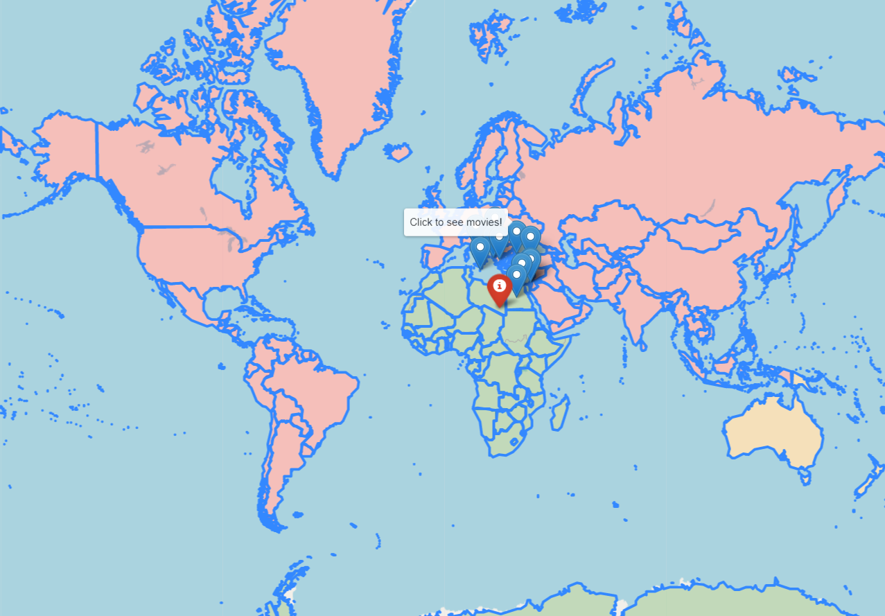

# MovieWebMap

MovieWebMap is a Python 3 project for creating an html (with JS usage) map of the world with markers of nearest movies to the user.

## Installation

Run
```python
pip install MovieWebMap
```

## Usage

```python
import MovieWebMap
MovieWebMap.mymodule.main()
```

## HTML description

In the head of the file all the CSS and JavaScript references are listed, like the links below.
```html
<script src="https://cdn.jsdelivr.net/npm/leaflet@1.5.1/dist/leaflet.js"></script>
    <script src="https://code.jquery.com/jquery-1.12.4.min.js"></script>
    <script src="https://maxcdn.bootstrapcdn.com/bootstrap/3.2.0/js/bootstrap.min.js"></script>
    <script src="https://cdnjs.cloudflare.com/ajax/libs/Leaflet.awesome-markers/2.0.2/leaflet.awesome-markers.js"></script>
    <link rel="stylesheet" href="https://cdn.jsdelivr.net/npm/leaflet@1.5.1/dist/leaflet.css"/>
    <link rel="stylesheet" href="https://maxcdn.bootstrapcdn.com/bootstrap/3.2.0/css/bootstrap.min.css"/>
```
In the body there's only one object - the map governed by JavaScript
```html
<body>    
    
            <div class="folium-map" id="map_833e028b347b4b7d84b61710fe31968a" ></div>
        
</body>
```
And in the ```<script></script>``` part of the page all the JS code is.
Markers for the movies are listed first
```html
        marker_9c0b2d8b070d4f2dacca8a1054e47092.bindPopup(popup_f6603da0dc564733b9ec136ca4142e3c)
        ;

        
    
    
            marker_9c0b2d8b070d4f2dacca8a1054e47092.bindTooltip(
                `<div>
                     Click to see movies!
                 </div>`,
                {"sticky": true}
            );
        
    
            var marker_2dd39d2957a6460aa219d380d2552bdf = L.marker(
                [35.8885993, 14.4476911],
                {}
            ).addTo(feature_group_0fe8838aec284a31a1a004884ed82213);
        
    
        var popup_9194258d35cd4b4d8530421284d412e5 = L.popup({"maxWidth": "100%"});

        
            var html_666a427db44a4b7aa764c7cd38a21a04 = $(`<div id="html_666a427db44a4b7aa764c7cd38a21a04" style="width: 100.0%; height: 100.0%;"><i>1000: The Sword in the Stone     &     Betrayals</i></div>`)[0];
            popup_9194258d35cd4b4d8530421284d412e5.setContent(html_666a427db44a4b7aa764c7cd38a21a04);
        
```
Then comes code for the third layer: the style function
```html
function geo_json_8c654210f0b749d58c3b9eca1ae0bd90_styler(feature) {
            switch(feature.properties.ISO2) {
                case "DZ": case "AO": case "BJ": case "CG": case "CD": case "BI": case "CM": case "TD": case "KM": case "CF": case "CV": case "DJ": case "EG": case "GQ": case "ER": case "ET": case "GM": case "GA": case "GH": case "GN": case "CI": case "KE": case "LR": case "LY": case "MG": case "ML": case "MA": case "MU": case "MR": case "MZ": case "MW": case "NE": case "YT": case "CC": case "AQ": case "BV": case "TF": case "HM": case "IO": case "CX": case "UM": case "NG": case "GW": case "RE": case "RW": case "SC": case "ZA": case "LS": case "BW": case "SN": case "SL": case "SO": case "SD": case "TG": case "ST": case "TN": case "TZ": case "UG": case "BF": case "NA": case "SZ": case "ZM": case "ZW": case "SH": case "EH": case "GS": case "TW": 
                    return {"fillColor": "green"};
                case "AS": case "AU": case "SB": case "CK": case "FJ": case "FM": case "PF": case "GU": case "KI": case "NC": case "NU": case "MP": case "NF": case "VU": case "NR": case "NZ": case "PG": case "TK": case "TO": case "TV": case "WF": case "WS": case "PN": case "PW": case "MH": 
                    return {"fillColor": "orange"};
                default:
                    return {"fillColor": "red"};
            }
        }
```
Other functions and the json object imported from the file.
```html
            geo_json_8c654210f0b749d58c3b9eca1ae0bd90_add({"crs": {"properties": {"name": "urn:ogc:def:crs:OGC:1.3:CRS84"}, "type": "name"}, "features": [{"geometry": {"coordinates": [[[[-61.686668, 17.024441000000134], [-61.73806, 16.989719], [-61.82917, 16.996944], [-61.88361, 17.023609], [-61.887222, 17.10527], [-61.832779, 17.16389], [-61.79445, 17.16333], [-61.67028, 17.090275], [-61.686668, 17.024441000000134]]], [[[-61.72917, 17.608608], [-61.73278, 17.541111], [-61.85306, 17.583054], [-61.873062, 17.703888], [-61.84556, 17.724998], [-61.78722, 17.700554], [-61.72917, 17.608608]]]], "type": "MultiPolygon"}, "properties": {"AREA": 44, "FIPS": "AC", "ISO2": "AG", "ISO3": "ATG", "LAT": 17.078, "LON": -61.783, "NAME": "Antigua and Barbuda", "POP2005": 83039, "REGION": 19, "SUBREGION": 29, "UN": 28}, "type": "Feature"}, {"geometry": {"coordinates": [[[2.96361, 36.802216], [3.031389, 36.806389], [3.138333, 36.738327], [3.228055, ...
```
Finally there is layer control
```html
            var layer_control_9ecd3455fc3c4f3b9439719e890f11d0 = {
                base_layers : {
                    "openstreetmap" : tile_layer_9610caac3bb94102a1f1e94f69126f76,
                },
                overlays :  {
                    "Movie map" : feature_group_0fe8838aec284a31a1a004884ed82213,
                    "World Part" : feature_group_982d3b316c5e47c7bd8ba6112d229b33,
                },
            };
            L.control.layers(
                layer_control_9ecd3455fc3c4f3b9439719e890f11d0.base_layers,
                layer_control_9ecd3455fc3c4f3b9439719e890f11d0.overlays,
                {"autoZIndex": true, "collapsed": true, "position": "topright"}
            ).addTo(map_833e028b347b4b7d84b61710fe31968a);
        
```
And that concludes the ```<script></script>``` part of the page and the page itself.

## Conclusion

This map offers useful information on where are the nearest movies to the user. This way the user can visit the places where those movies were shot or vice versa: see the movies that were shot in a place s/he liked.

## Example
```python
Generate file from scratch (may take longer than 3 minutes)(y/n): n
Enter your latitude:23
Enter your longitude:22
Enter the year: 2019
```

Where the red marker is the user.

## License
[MIT](https://choosealicense.com/licenses/mit/)